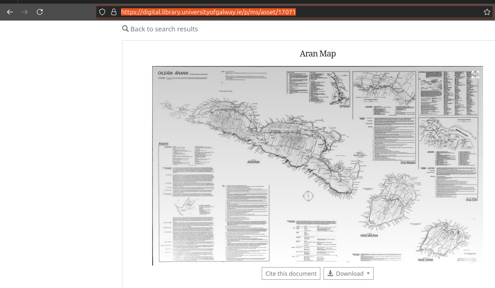
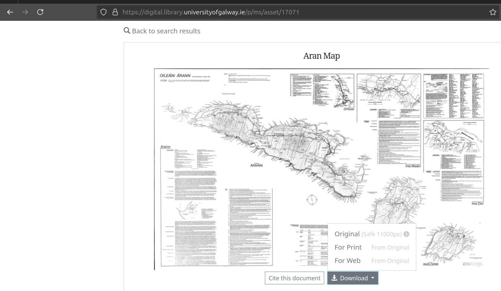
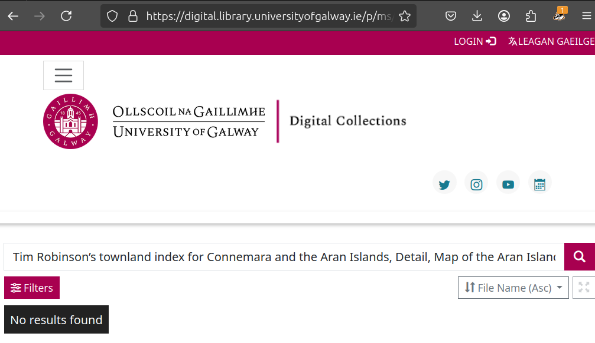
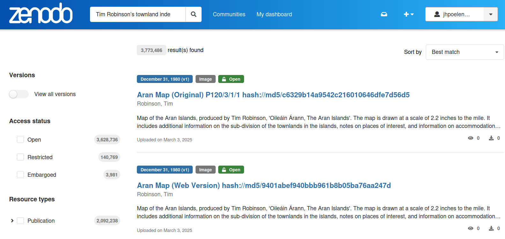
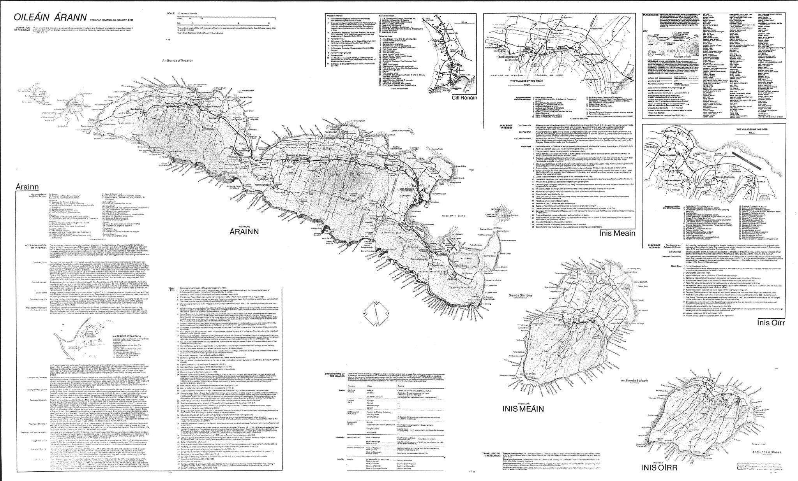

## Guiding Questions

 * How do you cite *your* research data?
 * How do you lookup cited data *now*? 
 * How do you lookup cited research data *40 years from now*? 

## Research Data In the Wild

> While walking the land, I am the pen on the paper; while drawing this map, my pen is myself walking the land. I wanted to short circuit the polarities of objectivity and subjectivity, and try keep faith with reality.  – Tim Robinson

## There's a Map on the Internet. . . 

## There's a Map on the Internet. . . 

## But, Where is the Original? 

## This One? 

## With Preferred Citation

## But . . . Which One are We Citing?

## Trying NUI Galway's Digital Library ...

## Trying Zenodo . . . 

## How To Retrieve Robinson's Map Today?

 * turn on the internet
 * open a web browser
 * search the internet for keywords
   * and rely on a delicate and complex socio-technical network 
 * inspect result pages
 * use mouse to click on a link that looks like Robinson's map
 * download image and **trust** its authenticity

## How To Retrieve Robinson's Map 40 Years From Now?

 * turn on the internet (***Still there?***)
 * open a web browser (***Grandma, what is a browser?***)
 * search the internet for keywords (***Internet search? Huh?***)
   * and rely on a delicate and complex socio-technical network
 * inspect result pages 
 * use mouse to click on a link that looks like Robinson's map
 * download image and **trust** its authenticity

## How To Retrieve Robinson's Map 40 Years From Now?

 * turn on the internet
 * open a web browser
 * search the internet for keywords
   * **and rely on a delicate and complex socio-technical network**
 * inspect result pages
 * use mouse to click on a link that looks like Robinson's map
 * download image and **trust** its authenticity

**Likely will not work due to intricate network of dependencies.**

## How To Retrieve Robinson's 40 Years From Now?

**My (Crazy?) Proposal**: Sign the citation ^[Elliott M.J., Poelen, J.H. & Fortes, J.A.B. (2023) Signing data citations enables data verification and citation persistence. *Sci Data*. https://doi.org/10.1038/s41597-023-02230-y [hash://sha256/f849c870565f608899f183ca261365dce9c9f1c5441b1c779e0db49df9c2a19d](https://linker.bio/hash://sha256/f849c870565f608899f183ca261365dce9c9f1c5441b1c779e0db49df9c2a19d)] 

Robinson, T. (1980). Aran Map (Print Version) P120/3/1/1 hash://md5/9027bb8d372e4ffb9fabe74cab6a3434. University of Galway. https://doi.org/10.5281/zenodo.14958167

## How To Retrieve Robinson's Map 40 Years From Now?

... by searching the universe (in, and beyond, the internet) for the content with the unique fingerprint hash://md5/9027bb8d372e4ffb9fabe74cab6a3434 .

... in addition to searching by keywords 

## Zenodo Search, Take 2.

## How Would *You* Carry Robinson's Maps Into The Future?

---

## Guiding Questions

 * How do *you* cite data?
 * How do you look up cited data *now*?
 * How do you look up cited data *40 years from now*?

---

## Extra

---

## Internet Is Designed For *Exchanging* Information 

> The internet is a powerful tool for exchanging digital information. But the Internet’s contents changes constantly: websites are launched and taken down, webpages change, and content gets archived or lost.^[Jorrit Poelen. 2024. Unleashing Digital Knowledge Into The Future. Accessed on 2024-02-06 at https://linker.bio [line:hash://sha256/8ac18eb75ff20d40d1d60bb6ad5a745eb528093d1ffbe373e3847c13146091eb!/L12](https://linker.bio/line:hash://sha256/8ac18eb75ff20d40d1d60bb6ad5a745eb528093d1ffbe373e3847c13146091eb!/L12)]

---

## Internet Is *Location-based*

> By design, a web address, or Uniform Resource Locator (URL), points to a specific internet location from which a resource, like a webpage, can be retrieved. However, a URL does not provide a way to verify that a retrieved webpage was the one we asked for. ^[Jorrit Poelen. 2024. Unleashing Digital Knowledge Into The Future. Accessed on 2024-02-06 at https://linker.bio [line:hash://sha256/8ac18eb75ff20d40d1d60bb6ad5a745eb528093d1ffbe373e3847c13146091eb!/L14](https://linker.bio/line:hash://sha256/8ac18eb75ff20d40d1d60bb6ad5a745eb528093d1ffbe373e3847c13146091eb!/L14)]

---

## Finding Content By Their Location Is ... Tricky

> Imagine using a URL-like reference to find a book at a library: instead of locating a book by what it is (e.g., title, author), you refer to a book by its location (e.g., third shelf on the second row next to the window). With this, a book becomes unfindable if moved to another shelf. And, if you do manage to find a book at the referenced location, how would you know you’ve found the book you are looking for? ^[Jorrit Poelen. 2024. Unleashing Digital Knowledge Into The Future. Accessed on 2024-02-06 at https://linker.bio [line:hash://sha256/8ac18eb75ff20d40d1d60bb6ad5a745eb528093d1ffbe373e3847c13146091eb!/L16](https://linker.bio/line:hash://sha256/8ac18eb75ff20d40d1d60bb6ad5a745eb528093d1ffbe373e3847c13146091eb!/L16)]

---

## Finding Content By Their (Summarized) Content Is ... What Librarians Do

> Instead of pointing to where books are located, librarians point to them using a bibliographic reference. For practical reasons, only a few identifying clues are included in such a reference (e.g., author, year of publication, title, and publisher). **So, librarians refer to content by what it is, and knowing where it may be located is secondary.** ^[Jorrit Poelen. 2024. Unleashing Digital Knowledge Into The Future. Accessed on 2024-02-06 at https://linker.bio [line:hash://sha256/8ac18eb75ff20d40d1d60bb6ad5a745eb528093d1ffbe373e3847c13146091eb!/L18](https://linker.bio/line:hash://sha256/8ac18eb75ff20d40d1d60bb6ad5a745eb528093d1ffbe373e3847c13146091eb!/L18)]

A bibliographic citation:

Darwin, C. 1859. On the Origin of Species. John Murray.

---

